```python
import pandas as pd
import matplotlib.pyplot as plt
import numpy as np
from sklearn.cluster import KMeans
import seaborn as sns
```

**Load the dataset**


```python
data=pd.read_csv("train.csv",index_col="PassengerId")
```


```python
data.head(10)
```


<div>
<style scoped>
    .dataframe tbody tr th:only-of-type {
        vertical-align: middle;
    }

    .dataframe tbody tr th {
        vertical-align: top;
    }

    .dataframe thead th {
        text-align: right;
    }
</style>
<table border="1" class="dataframe">
  <thead>
    <tr style="text-align: right;">
      <th></th>
      <th>HomePlanet</th>
      <th>CryoSleep</th>
      <th>Cabin</th>
      <th>Destination</th>
      <th>Age</th>
      <th>VIP</th>
      <th>RoomService</th>
      <th>FoodCourt</th>
      <th>ShoppingMall</th>
      <th>Spa</th>
      <th>VRDeck</th>
      <th>Name</th>
      <th>Transported</th>
    </tr>
    <tr>
      <th>PassengerId</th>
      <th></th>
      <th></th>
      <th></th>
      <th></th>
      <th></th>
      <th></th>
      <th></th>
      <th></th>
      <th></th>
      <th></th>
      <th></th>
      <th></th>
      <th></th>
    </tr>
  </thead>
  <tbody>
    <tr>
      <th>0001_01</th>
      <td>Europa</td>
      <td>False</td>
      <td>B/0/P</td>
      <td>TRAPPIST-1e</td>
      <td>39.0</td>
      <td>False</td>
      <td>0.0</td>
      <td>0.0</td>
      <td>0.0</td>
      <td>0.0</td>
      <td>0.0</td>
      <td>Maham Ofracculy</td>
      <td>False</td>
    </tr>
    <tr>
      <th>0002_01</th>
      <td>Earth</td>
      <td>False</td>
      <td>F/0/S</td>
      <td>TRAPPIST-1e</td>
      <td>24.0</td>
      <td>False</td>
      <td>109.0</td>
      <td>9.0</td>
      <td>25.0</td>
      <td>549.0</td>
      <td>44.0</td>
      <td>Juanna Vines</td>
      <td>True</td>
    </tr>
    <tr>
      <th>0003_01</th>
      <td>Europa</td>
      <td>False</td>
      <td>A/0/S</td>
      <td>TRAPPIST-1e</td>
      <td>58.0</td>
      <td>True</td>
      <td>43.0</td>
      <td>3576.0</td>
      <td>0.0</td>
      <td>6715.0</td>
      <td>49.0</td>
      <td>Altark Susent</td>
      <td>False</td>
    </tr>
    <tr>
      <th>0003_02</th>
      <td>Europa</td>
      <td>False</td>
      <td>A/0/S</td>
      <td>TRAPPIST-1e</td>
      <td>33.0</td>
      <td>False</td>
      <td>0.0</td>
      <td>1283.0</td>
      <td>371.0</td>
      <td>3329.0</td>
      <td>193.0</td>
      <td>Solam Susent</td>
      <td>False</td>
    </tr>
    <tr>
      <th>0004_01</th>
      <td>Earth</td>
      <td>False</td>
      <td>F/1/S</td>
      <td>TRAPPIST-1e</td>
      <td>16.0</td>
      <td>False</td>
      <td>303.0</td>
      <td>70.0</td>
      <td>151.0</td>
      <td>565.0</td>
      <td>2.0</td>
      <td>Willy Santantines</td>
      <td>True</td>
    </tr>
    <tr>
      <th>0005_01</th>
      <td>Earth</td>
      <td>False</td>
      <td>F/0/P</td>
      <td>PSO J318.5-22</td>
      <td>44.0</td>
      <td>False</td>
      <td>0.0</td>
      <td>483.0</td>
      <td>0.0</td>
      <td>291.0</td>
      <td>0.0</td>
      <td>Sandie Hinetthews</td>
      <td>True</td>
    </tr>
    <tr>
      <th>0006_01</th>
      <td>Earth</td>
      <td>False</td>
      <td>F/2/S</td>
      <td>TRAPPIST-1e</td>
      <td>26.0</td>
      <td>False</td>
      <td>42.0</td>
      <td>1539.0</td>
      <td>3.0</td>
      <td>0.0</td>
      <td>0.0</td>
      <td>Billex Jacostaffey</td>
      <td>True</td>
    </tr>
    <tr>
      <th>0006_02</th>
      <td>Earth</td>
      <td>True</td>
      <td>G/0/S</td>
      <td>TRAPPIST-1e</td>
      <td>28.0</td>
      <td>False</td>
      <td>0.0</td>
      <td>0.0</td>
      <td>0.0</td>
      <td>0.0</td>
      <td>NaN</td>
      <td>Candra Jacostaffey</td>
      <td>True</td>
    </tr>
    <tr>
      <th>0007_01</th>
      <td>Earth</td>
      <td>False</td>
      <td>F/3/S</td>
      <td>TRAPPIST-1e</td>
      <td>35.0</td>
      <td>False</td>
      <td>0.0</td>
      <td>785.0</td>
      <td>17.0</td>
      <td>216.0</td>
      <td>0.0</td>
      <td>Andona Beston</td>
      <td>True</td>
    </tr>
    <tr>
      <th>0008_01</th>
      <td>Europa</td>
      <td>True</td>
      <td>B/1/P</td>
      <td>55 Cancri e</td>
      <td>14.0</td>
      <td>False</td>
      <td>0.0</td>
      <td>0.0</td>
      <td>0.0</td>
      <td>0.0</td>
      <td>0.0</td>
      <td>Erraiam Flatic</td>
      <td>True</td>
    </tr>
  </tbody>
</table>
</div>


```python
data.describe()
```


<div>
<style scoped>
    .dataframe tbody tr th:only-of-type {
        vertical-align: middle;
    }

    .dataframe tbody tr th {
        vertical-align: top;
    }

    .dataframe thead th {
        text-align: right;
    }
</style>
<table border="1" class="dataframe">
  <thead>
    <tr style="text-align: right;">
      <th></th>
      <th>Age</th>
      <th>RoomService</th>
      <th>FoodCourt</th>
      <th>ShoppingMall</th>
      <th>Spa</th>
      <th>VRDeck</th>
    </tr>
  </thead>
  <tbody>
    <tr>
      <th>count</th>
      <td>8514.000000</td>
      <td>8512.000000</td>
      <td>8510.000000</td>
      <td>8485.000000</td>
      <td>8510.000000</td>
      <td>8505.000000</td>
    </tr>
    <tr>
      <th>mean</th>
      <td>28.827930</td>
      <td>224.687617</td>
      <td>458.077203</td>
      <td>173.729169</td>
      <td>311.138778</td>
      <td>304.854791</td>
    </tr>
    <tr>
      <th>std</th>
      <td>14.489021</td>
      <td>666.717663</td>
      <td>1611.489240</td>
      <td>604.696458</td>
      <td>1136.705535</td>
      <td>1145.717189</td>
    </tr>
    <tr>
      <th>min</th>
      <td>0.000000</td>
      <td>0.000000</td>
      <td>0.000000</td>
      <td>0.000000</td>
      <td>0.000000</td>
      <td>0.000000</td>
    </tr>
    <tr>
      <th>25%</th>
      <td>19.000000</td>
      <td>0.000000</td>
      <td>0.000000</td>
      <td>0.000000</td>
      <td>0.000000</td>
      <td>0.000000</td>
    </tr>
    <tr>
      <th>50%</th>
      <td>27.000000</td>
      <td>0.000000</td>
      <td>0.000000</td>
      <td>0.000000</td>
      <td>0.000000</td>
      <td>0.000000</td>
    </tr>
    <tr>
      <th>75%</th>
      <td>38.000000</td>
      <td>47.000000</td>
      <td>76.000000</td>
      <td>27.000000</td>
      <td>59.000000</td>
      <td>46.000000</td>
    </tr>
    <tr>
      <th>max</th>
      <td>79.000000</td>
      <td>14327.000000</td>
      <td>29813.000000</td>
      <td>23492.000000</td>
      <td>22408.000000</td>
      <td>24133.000000</td>
    </tr>
  </tbody>
</table>
</div>


**We will first explore the Age of Passengers. We already know some basic information such as the mean of Age data is 29 years while median is 27 years. Min age is 0 while max age is 79 years. Lets explore more to gain more insight.**


```python
percentile_90 = data['Age'].quantile(0.90)
percentile_90
```


    49.0


**This shows that 90% of Passengers Age is Below 49 years. Lets make a histogram to see the distribution of Age**


```python
Age=data['Age'].dropna()
sns.histplot(Age,bins=15,kde=True)
plt.xlabel('Age')          
plt.ylabel('Frequency')     
plt.title('Histogram of Age of Passengers')
plt.show()
```

    C:\Users\ASUS\anaconda3\Lib\site-packages\seaborn\_oldcore.py:1119: FutureWarning: use_inf_as_na option is deprecated and will be removed in a future version. Convert inf values to NaN before operating instead.
      with pd.option_context('mode.use_inf_as_na', True):
    


    
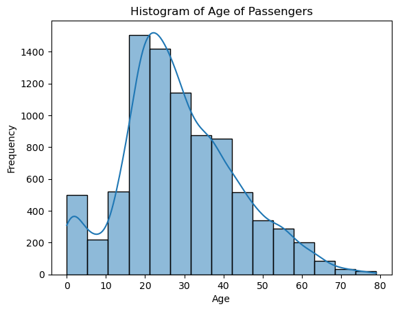
    


**As We can see from the histogram most of the passengers are on age below 49 years**


```python
nan_count_HomePlanet = data['HomePlanet'].isnull().sum()
nan_count_HomePlanet
```


    201


```python
nan_count_Age = data['Age'].isnull().sum()
nan_count_Age
```


    179


**Out of 8693 data only 201 data in Home_Planet category is missing while only 179 data is missing in age category. Since missing data numbers are small, we can remove these columns for future consideration**


```python
data_clean = data.dropna(subset=['Age', 'HomePlanet'])
```


```python
mean_age_per_category=data_clean.groupby('HomePlanet')['Age'].mean()
mean_age_per_category
```


    HomePlanet
    Earth     26.068232
    Europa    34.419664
    Mars      29.297203
    Name: Age, dtype: float64


```python
plt.bar(mean_age_per_category.index, mean_age_per_category.values, color='blue', edgecolor='black',)

# Customize the axis labels and title
plt.xlabel('HomePlanet')
plt.ylabel('Mean Age')
plt.title('Mean Age per HomePlanet')

# Display the plot
plt.show()
```


    
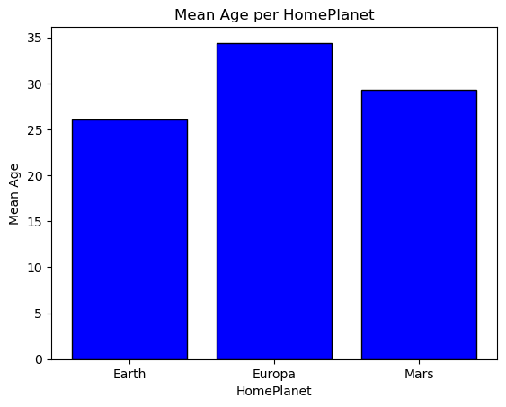
    


**This shows that Europa has the Highest mean of 34 while Earth had mean Age around 26 years and Mars had mean age of 29 years**


```python
nan_count_RoomService = data['RoomService'].isnull().sum()
nan_count_RoomService
```


    181


```python
zero_fare_count = (data['RoomService'] == 0).sum()
zero_fare_count
```


    5577


```python
data_clean_2=data_clean.dropna(subset=['RoomService'])
```

**To create scatterplot between Age and RoomService, all the RoomService having 0 value should be removed to gain good clarity**


```python
data_clean_Scatter_AgevsRoomService = data_clean_2
data_clean_Scatter_AgevsRoomService.loc[:, 'TotalSpending']=data_clean_2['RoomService']+data_clean_2['FoodCourt']+data_clean_2['ShoppingMall']+data_clean_2['Spa']+data_clean_2['VRDeck']
```

    C:\Users\ASUS\AppData\Local\Temp\ipykernel_14268\3921084810.py:2: SettingWithCopyWarning: 
    A value is trying to be set on a copy of a slice from a DataFrame.
    Try using .loc[row_indexer,col_indexer] = value instead
    
    See the caveats in the documentation: https://pandas.pydata.org/pandas-docs/stable/user_guide/indexing.html#returning-a-view-versus-a-copy
      data_clean_Scatter_AgevsRoomService.loc[:, 'TotalSpending']=data_clean_2['RoomService']+data_clean_2['FoodCourt']+data_clean_2['ShoppingMall']+data_clean_2['Spa']+data_clean_2['VRDeck']
    


```python
data_clean_Scatter_AgevsRoomService.describe()
```


<div>
<style scoped>
    .dataframe tbody tr th:only-of-type {
        vertical-align: middle;
    }

    .dataframe tbody tr th {
        vertical-align: top;
    }

    .dataframe thead th {
        text-align: right;
    }
</style>
<table border="1" class="dataframe">
  <thead>
    <tr style="text-align: right;">
      <th></th>
      <th>Age</th>
      <th>RoomService</th>
      <th>FoodCourt</th>
      <th>ShoppingMall</th>
      <th>Spa</th>
      <th>VRDeck</th>
      <th>TotalSpending</th>
    </tr>
  </thead>
  <tbody>
    <tr>
      <th>count</th>
      <td>8141.000000</td>
      <td>8141.000000</td>
      <td>7966.000000</td>
      <td>7948.00000</td>
      <td>7965.000000</td>
      <td>7959.000000</td>
      <td>7438.000000</td>
    </tr>
    <tr>
      <th>mean</th>
      <td>28.866478</td>
      <td>226.423044</td>
      <td>464.431333</td>
      <td>176.46540</td>
      <td>310.732329</td>
      <td>304.697826</td>
      <td>1498.157435</td>
    </tr>
    <tr>
      <th>std</th>
      <td>14.480122</td>
      <td>674.678833</td>
      <td>1623.475195</td>
      <td>613.17147</td>
      <td>1135.979248</td>
      <td>1148.990480</td>
      <td>2870.470969</td>
    </tr>
    <tr>
      <th>min</th>
      <td>0.000000</td>
      <td>0.000000</td>
      <td>0.000000</td>
      <td>0.00000</td>
      <td>0.000000</td>
      <td>0.000000</td>
      <td>0.000000</td>
    </tr>
    <tr>
      <th>25%</th>
      <td>19.000000</td>
      <td>0.000000</td>
      <td>0.000000</td>
      <td>0.00000</td>
      <td>0.000000</td>
      <td>0.000000</td>
      <td>0.000000</td>
    </tr>
    <tr>
      <th>50%</th>
      <td>27.000000</td>
      <td>0.000000</td>
      <td>0.000000</td>
      <td>0.00000</td>
      <td>0.000000</td>
      <td>0.000000</td>
      <td>737.000000</td>
    </tr>
    <tr>
      <th>75%</th>
      <td>38.000000</td>
      <td>48.000000</td>
      <td>81.000000</td>
      <td>29.00000</td>
      <td>61.000000</td>
      <td>47.000000</td>
      <td>1513.750000</td>
    </tr>
    <tr>
      <th>max</th>
      <td>79.000000</td>
      <td>14327.000000</td>
      <td>29813.000000</td>
      <td>23492.00000</td>
      <td>22408.000000</td>
      <td>24133.000000</td>
      <td>35987.000000</td>
    </tr>
  </tbody>
</table>
</div>


```python
data_clean_Scatter_AgevsRoomService['TotalSpending'].isnull().sum()
```


    703


```python
data_clean_Scatter_AgevsRoomService_clean=data_clean_Scatter_AgevsRoomService.dropna(subset=['TotalSpending'])
```


```python
((data_clean_Scatter_AgevsRoomService_clean['TotalSpending']>0) & (data_clean_Scatter_AgevsRoomService_clean['TotalSpending']<7000)).sum()
```


    4002


**As we can see out of 4346(excluding 0) data points 40002 lies in the range from 0 to 7000, so we will set this as y limit for our scatterplot and clustering**


```python
data_clean_Scatter_AgevsRoomService_clean_2=data_clean_Scatter_AgevsRoomService_clean[(data_clean_Scatter_AgevsRoomService_clean['TotalSpending']>0) & (data_clean_Scatter_AgevsRoomService_clean['TotalSpending']<7000)]
plt.scatter(data_clean_Scatter_AgevsRoomService_clean_2['Age'],data_clean_Scatter_AgevsRoomService_clean_2['TotalSpending'],alpha=1)

# Customize the axis labels and title
plt.xlabel('Age')
plt.ylabel('Total Spending')
plt.title('Scatter Plot of Age vs Total Spending with Clusters')
plt.legend()
plt.show()
```

    No artists with labels found to put in legend.  Note that artists whose label start with an underscore are ignored when legend() is called with no argument.
    


    
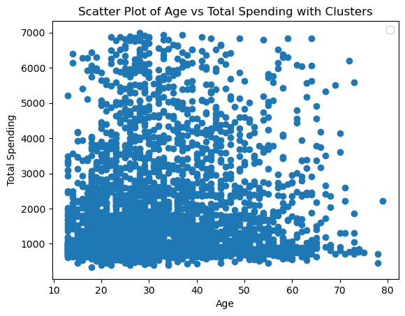
    


**From this scatterplot we can see that Passengers spent Below 2000 and people above 10 and below 40 are highest in number**


```python
nan_value_cyrosleep=data_clean_2['CryoSleep'].isnull().sum()
nan_value_cyrosleep
```


    212


```python
data_clean_3=data_clean_2.dropna(subset=['CryoSleep'])
```


```python
data_clean_3.groupby('CryoSleep')['Age'].mean()
```


    CryoSleep
    False    29.691119
    True     27.440895
    Name: Age, dtype: float64


```python
plt.figure(figsize=(10, 6))
sns.boxplot(x='CryoSleep', y='Age', data=data_clean_3)

# Customize the axis labels and title
plt.xlabel('People in CyroSleep')
plt.ylabel('Age')
plt.title('Box Plot of Age vs People in Cyrosleep')

# Display the plot
plt.show()
```


    
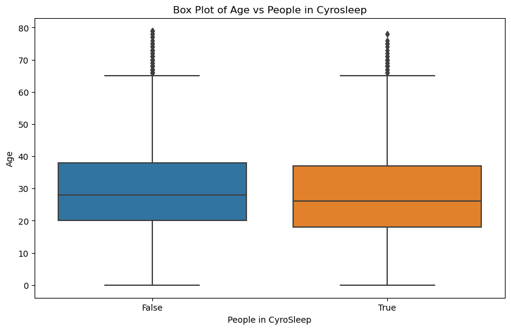
    


**The median,mean,25% and 75% quartile of age of passengers in cyrosleep and not in cyroSleep seems almost identical**


```python
nan_value_destination=data_clean_3['Destination'].isnull().sum()
nan_value_destination
```


    168


```python
data_clean_4=data_clean_3.dropna(subset=['Destination'])
```


```python
data_clean_3.groupby('Destination')['Age'].mean()
```


    Destination
    55 Cancri e      29.345345
    PSO J318.5-22    27.796143
    TRAPPIST-1e      28.863873
    Name: Age, dtype: float64


```python
data_clean_3.groupby('Destination')['Age'].median()
```


    Destination
    55 Cancri e      28.0
    PSO J318.5-22    24.0
    TRAPPIST-1e      27.0
    Name: Age, dtype: float64


```python
cryo_sleep_counts = data_clean_3['CryoSleep'].value_counts()

# Plot the pie chart
plt.figure(figsize=(8, 8))
plt.pie(cryo_sleep_counts, labels=cryo_sleep_counts.index, autopct='%1.1f%%', startangle=90, colors=['lightblue', 'lightgreen'])
plt.title('Passengers in CryoSleep')
plt.show()
```


    
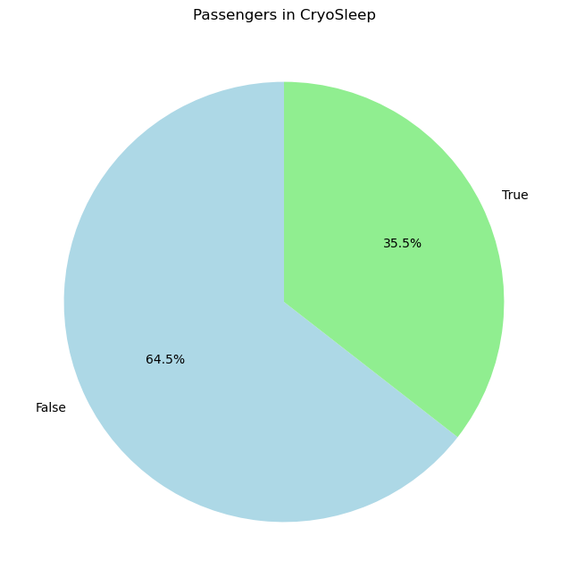
    


```python
plt.figure(figsize=(10, 7))
sns.boxplot(x='Destination', y='Age', data=data_clean_4)

# Customize the axis labels and title
plt.xlabel('Destination')
plt.ylabel('Age')
plt.title('Box Plot of Age vs Destination')

# Display the plot
plt.show()
```


    
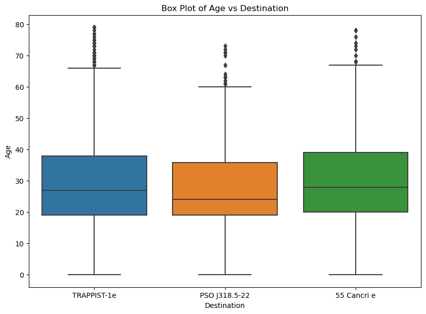
    


**The distribution of Age and destination is shown and for the 3 destination it seems almost identical**

**64.5% of Passengers are not in cyrosleep while 35.5% are in cyrosleep**


```python
Passenger_Home_Planets = data_clean['HomePlanet'].value_counts()
home_planet_percentages = (Passenger_Home_Planets / len(data_clean) * 100).round(2)
Passenger_Home_Planets.index.name='Home_Planet'

plt.figure(figsize=(10, 6))
Passenger_Home_Planets.plot(kind='bar', color='skyblue', edgecolor='black')

# Customize the axis labels and title
plt.xlabel('Home Planet')
plt.ylabel('Number of Passengers')
plt.title('Passenger\'s Home Planets')

# Display the plot
plt.show()
print(f"Percentage of Passengers in each {home_planet_percentages}")
```


    
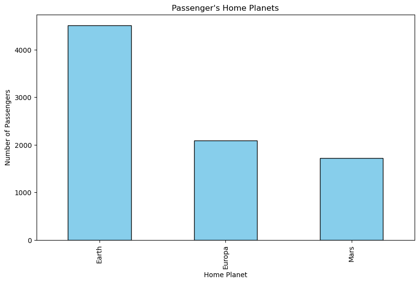
    


    Percentage of Passengers in each Home_Planet
    Earth     54.29
    Europa    25.08
    Mars      20.64
    Name: count, dtype: float64
    

**54.3% Passenger are from Earth while only 20.5% are from Mars** 


```python
nan_value_vip=data_clean_4['VIP'].isnull().sum()
nan_value_vip
```


    180


```python
data_clean_5=data_clean_4.dropna(subset=['VIP'])
```


```python
VIP_Status=data_clean_5['VIP'].value_counts()
plt.figure(figsize=(8, 8))
plt.pie(VIP_Status, labels=VIP_Status.index, autopct='%1.1f%%', startangle=90, colors=['lightblue', 'lightgreen'])
plt.title('VIP_Status')
plt.show()
print(f"{VIP_Status}")
```


    
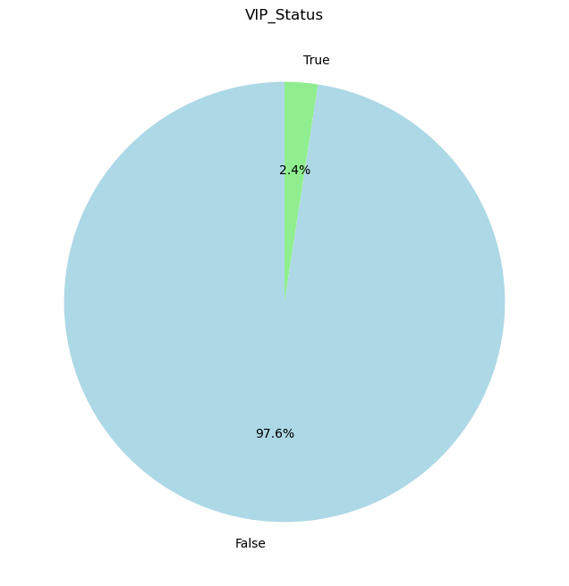
    


    VIP
    False    7397
    True      184
    Name: count, dtype: int64
    

**Only 2.4% or 184 Passengers have VIP status**


```python
spending_columns = ['RoomService', 'FoodCourt', 'ShoppingMall', 'Spa', 'VRDeck']
data_clean_6 = data.dropna(subset=spending_columns)
data_melted = data_clean_6.melt(value_vars=spending_columns, var_name='Amenity', value_name='Spending')
dark_palette = sns.color_palette("dark", 5)
plt.figure(figsize=(12, 8))
sns.stripplot(x='Amenity', y='Spending', data=data_melted,jitter=True,palette=dark_palette)

# Customize the axis labels and title
plt.xlabel('Amenity')
plt.ylabel('Spending')
plt.title('Violin Plots of Spending Across Different Amenities')

# Display the plot
plt.show()
```

    C:\Users\ASUS\AppData\Local\Temp\ipykernel_14268\1781556036.py:6: FutureWarning: Passing `palette` without assigning `hue` is deprecated.
      sns.stripplot(x='Amenity', y='Spending', data=data_melted,jitter=True,palette=dark_palette)
    C:\Users\ASUS\anaconda3\Lib\site-packages\seaborn\_oldcore.py:1119: FutureWarning: use_inf_as_na option is deprecated and will be removed in a future version. Convert inf values to NaN before operating instead.
      with pd.option_context('mode.use_inf_as_na', True):
    C:\Users\ASUS\anaconda3\Lib\site-packages\seaborn\_oldcore.py:1119: FutureWarning: use_inf_as_na option is deprecated and will be removed in a future version. Convert inf values to NaN before operating instead.
      with pd.option_context('mode.use_inf_as_na', True):
    


    
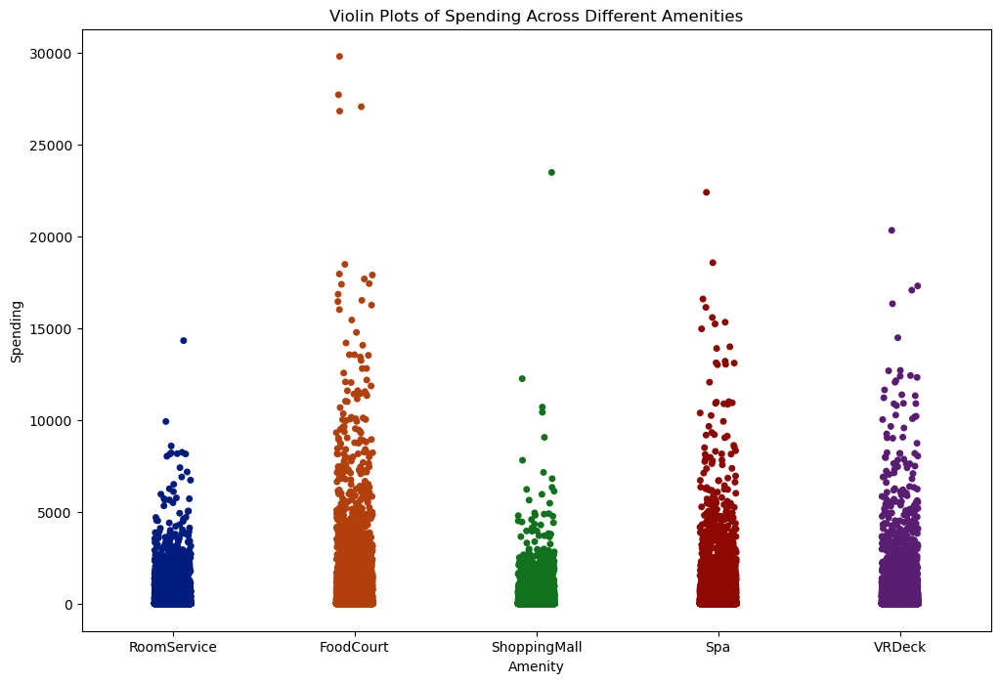
    


**This shows that most of the high spending has occured in Food Court followed closely by Spa or VRDeck and then RoomService.At last least Spending is done in Mall. The data below also confirms the same**


```python
Total_Room_Service=data['RoomService'].sum()
Total_Food_Court=data['FoodCourt'].sum()
Total_Shopping=data['ShoppingMall'].sum()
Total_Spa=data['Spa'].sum()
Total_VR_Deck=data['VRDeck'].sum()
```


```python
print(f"Food:{Total_Food_Court} \nSpaCost:{Total_Spa} \nVRDeck:{Total_VR_Deck} \nRoomService:{Total_Room_Service} \nShopping:{Total_Shopping} ")
```

    Food:3898237.0 
    SpaCost:2647791.0 
    VRDeck:2592790.0 
    RoomService:1912541.0 
    Shopping:1474092.0 
    


```python
Passengers_Destination= data_clean_4['Destination'].value_counts()
Destination_Percentage = (Passengers_Destination/ len(data_clean_4) * 100).round(2)
Passengers_Destination.index.name='Destination'

plt.figure(figsize=(10, 6))
Passengers_Destination.plot(kind='bar', color='skyblue', edgecolor='black')

# Customize the axis labels and title
plt.xlabel('Destination')
plt.ylabel('Number of Passengers')
plt.title('Passenger\'s Destination')

# Display the plot
plt.show()
print(f"Percentage of Passengers in each {Destination_Percentage}")
```


    
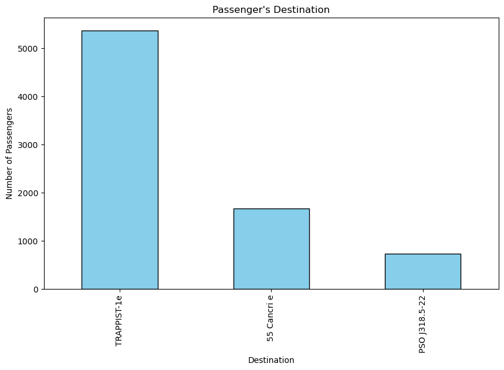
    


    Percentage of Passengers in each Destination
    TRAPPIST-1e      69.19
    55 Cancri e      21.45
    PSO J318.5-22     9.35
    Name: count, dtype: float64
    

**Approx 69% of Passengers were going to TRAPPIST-1e and only 9% are going to PSO**


```python
# Plot the histogram of total spending
plt.figure(figsize=(10, 6))
sns.histplot(data_clean_Scatter_AgevsRoomService_clean['TotalSpending'],bins=50,kde=True)
plt.title('Distribution of Total Spending per Passenger', fontsize=16)
plt.xlabel('Total Spending', fontsize=14)
plt.ylabel('Frequency', fontsize=14)
plt.show()
```

    C:\Users\ASUS\anaconda3\Lib\site-packages\seaborn\_oldcore.py:1119: FutureWarning: use_inf_as_na option is deprecated and will be removed in a future version. Convert inf values to NaN before operating instead.
      with pd.option_context('mode.use_inf_as_na', True):
    


    
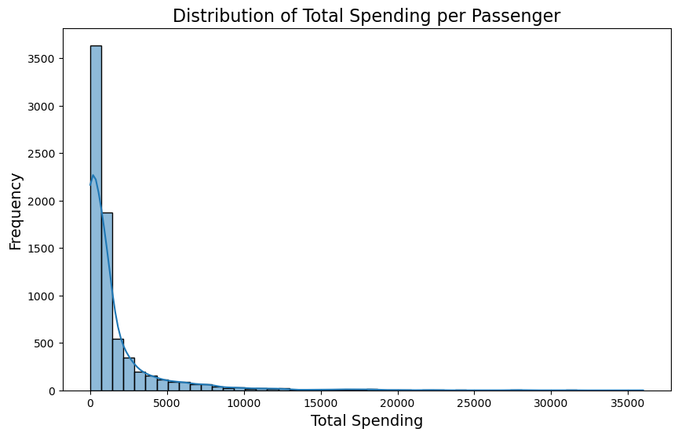
    


```python
plt.figure(figsize=(16, 10))
for i, column in enumerate(spending_columns, 1):
    plt.subplot(2, 3, i)
    sns.boxplot(x='VIP', y=column, data=data_clean_Scatter_AgevsRoomService_clean_2)
    plt.title(f'{column} Spending by VIP Status')
    plt.xlabel('VIP Status')
    plt.ylabel(f'{column} Spending')

plt.tight_layout()
plt.show()
```


    
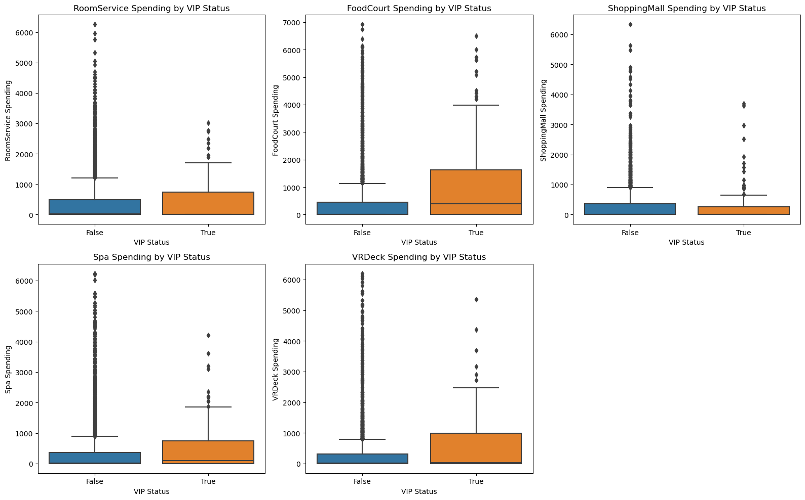
    


```python
df=data

df['Deck'] = df['Cabin'].str[0]

# Plot the distribution of cabin decks
plt.figure(figsize=(10, 6))
sns.countplot(x='Deck', data=df, order=df['Deck'].value_counts().index)
plt.title('Distribution of Cabin Decks', fontsize=16)
plt.xlabel('Deck', fontsize=14)
plt.ylabel('Number of Passengers', fontsize=14)
plt.show()
```


    
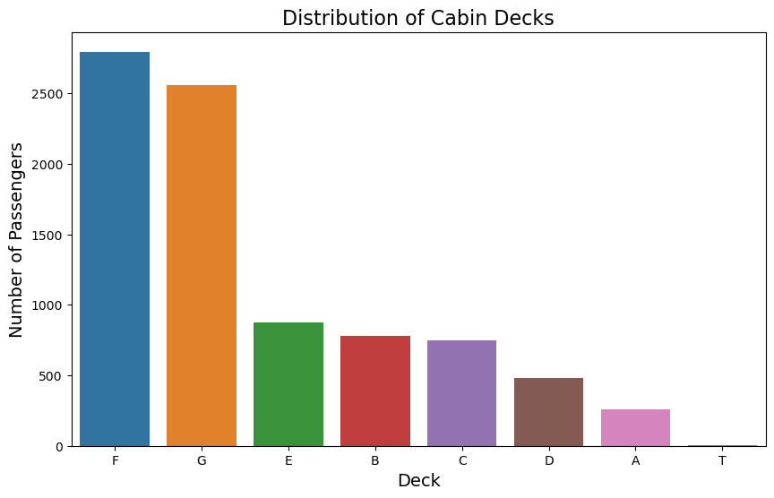
    


```python
# Define age groups
age_bins = [0, 18, 30, 45, 60, 75, 90]
age_labels = ['0-18', '19-30', '31-45', '46-60', '61-75', '76-90']

# Create a new column for age groups
df['AgeGroup'] = pd.cut(data_clean_Scatter_AgevsRoomService_clean_2['Age'], bins=age_bins, labels=age_labels)

# Plotting boxplots to compare spending for each amenity based on Age Group
plt.figure(figsize=(16, 10))

# Create a boxplot for each spending column by Age Group
for i, column in enumerate(spending_columns, 1):
    plt.subplot(2, 3, i)
    sns.boxplot(x='AgeGroup', y=column, data=df)
    plt.title(f'{column} Spending by Age Group')
    plt.xlabel('Age Group')
    plt.ylabel(f'{column} Spending')

plt.tight_layout()
plt.show()
```

    C:\Users\ASUS\anaconda3\Lib\site-packages\seaborn\categorical.py:641: FutureWarning: The default of observed=False is deprecated and will be changed to True in a future version of pandas. Pass observed=False to retain current behavior or observed=True to adopt the future default and silence this warning.
      grouped_vals = vals.groupby(grouper)
    C:\Users\ASUS\anaconda3\Lib\site-packages\seaborn\categorical.py:641: FutureWarning: The default of observed=False is deprecated and will be changed to True in a future version of pandas. Pass observed=False to retain current behavior or observed=True to adopt the future default and silence this warning.
      grouped_vals = vals.groupby(grouper)
    C:\Users\ASUS\anaconda3\Lib\site-packages\seaborn\categorical.py:641: FutureWarning: The default of observed=False is deprecated and will be changed to True in a future version of pandas. Pass observed=False to retain current behavior or observed=True to adopt the future default and silence this warning.
      grouped_vals = vals.groupby(grouper)
    C:\Users\ASUS\anaconda3\Lib\site-packages\seaborn\categorical.py:641: FutureWarning: The default of observed=False is deprecated and will be changed to True in a future version of pandas. Pass observed=False to retain current behavior or observed=True to adopt the future default and silence this warning.
      grouped_vals = vals.groupby(grouper)
    C:\Users\ASUS\anaconda3\Lib\site-packages\seaborn\categorical.py:641: FutureWarning: The default of observed=False is deprecated and will be changed to True in a future version of pandas. Pass observed=False to retain current behavior or observed=True to adopt the future default and silence this warning.
      grouped_vals = vals.groupby(grouper)
    


    
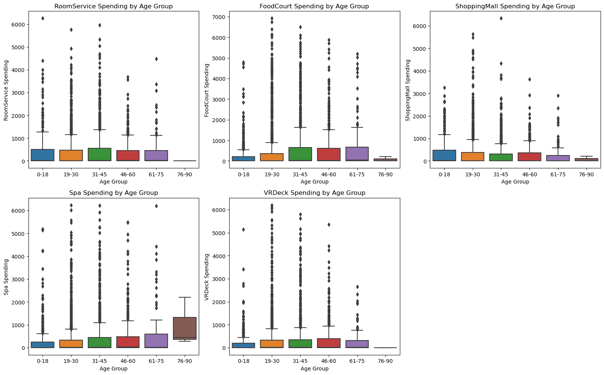
    


```python

```
